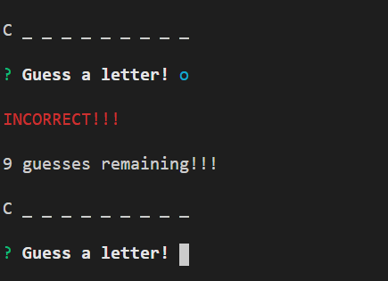

# Word-guess-game

## technologies used
* Javascript
* es6 classes
* nodejs
* chalk js
* inquirer

## Built 
built this command line game using nodejs. The game starts when u start running node index.js file
The game starts with a string of letters of movie name with some blanks for the player to guess a letter. If the letter guessed matches with letter then player gets a chance to proceed with the game, the player is left with 10 guesses. For every correct guess the message correct and for every wrong answer wrong message appears. The game finishes once the player has guessed the movie name right and he wins th game if he dont gues it right, he loses

# Mockup

